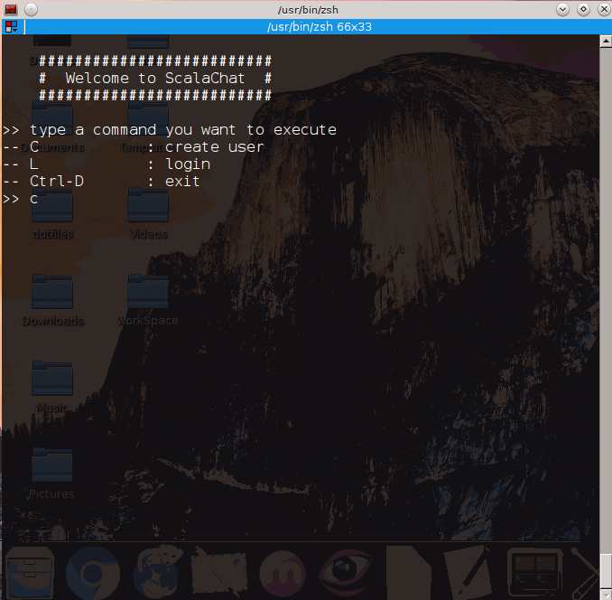

# Scala-Chat
* account creation(id, name, phone, address)
* login, logout
* add friend interactively
* previewing friend list
* private chat room
* unread messages notification
* read-marker
* log information will be sent to \*\*\*\*

### Requirements
* Scala execution environment
* Typesafe Activator

### Manual
just run it

### demo
